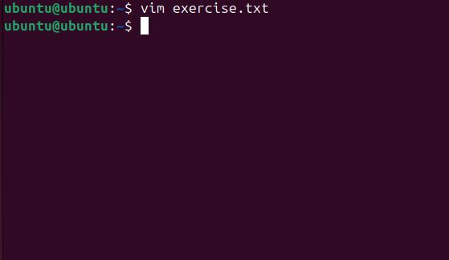
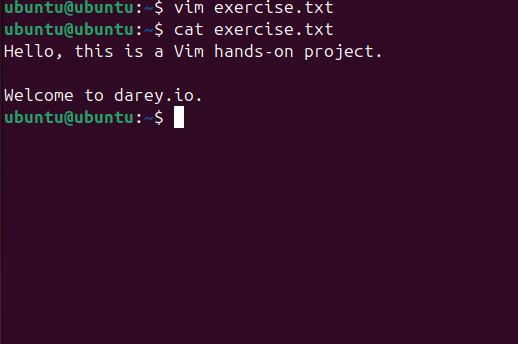
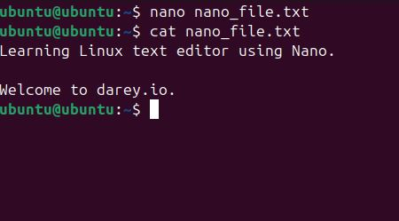
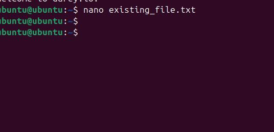

# Linux-Text-Editor-Project

## Project Review
Linux text editors are essential tools for developers, system administrators, and general users. They provide functionality for coding, scripting, and configuration file management. The study categorizes editors into terminal-based such as Vi, Vim, Nano etc. and GUI-based types (These editors provide graphical interfaces, making them suitable for users who prefer a visual experience such gedit, kate, Vscode etc), providing insights into their adoption based on user preferences and industry demands.

## Vim Editor

A powerful modal editor with extensive customization and scripting capabilities.

## Basic Commands and meaning;

- i (which means insert mode, so before you type click on 'i')
- esc (This is used to exit the insert mode)
- :wq (q is to exit vim while w is to save you work on vim)

## Task: Create a text file named 'exercise.txt' and type on it.

'Vim exercise.txt'

## Nano Editor

A simple, user-friendly editor ideal for beginners.

## Basic Commands and meaning;

- Ctrl + o (This is used to save your work on Nano)
- Ctrl + x (This is used to exit Nano)

## Task: Create a text file named 'nano_file.txt' and 'existing_file.txt'.

'nano nano_file.txt'

'nano existing_file.txt'

